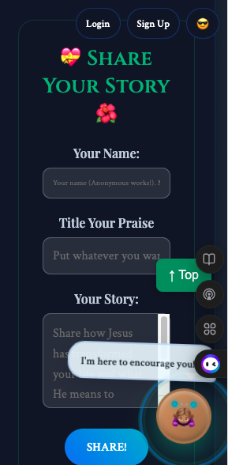
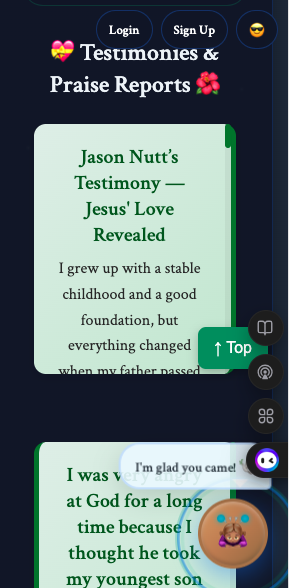
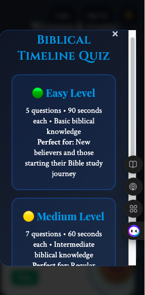
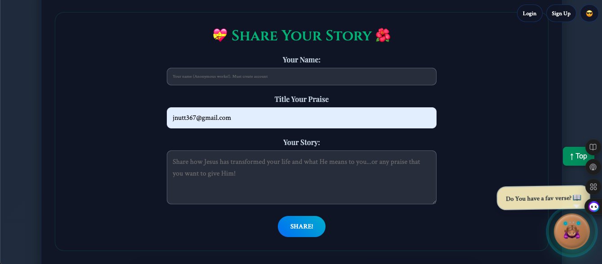
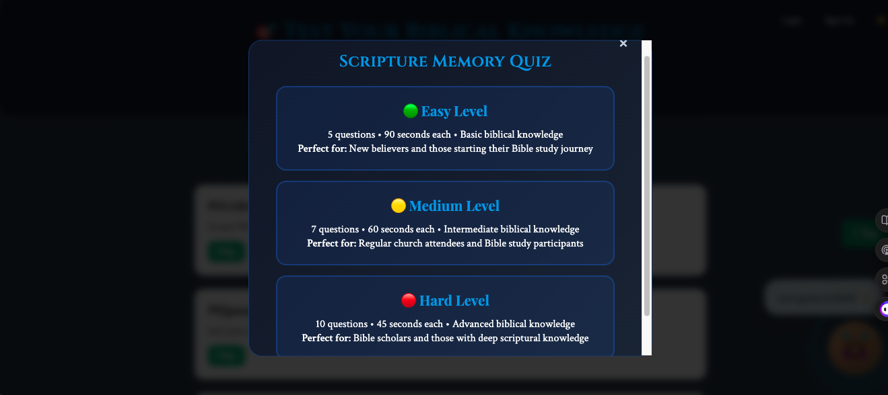

# Jesus' Love Revealed
A Bible study, testimony, and encouragement platform created by Jason Nutt.

  

📖 About the Project

Jesus Love Revealed is a simple and powerful Bible app designed to help people encounter the truth of God’s Word. The app includes daily scripture readings, user testimonies, Bible trivia, and special study content such as Enoch compilations, parables, and explainer videos.

This project is a free offering to the Body of Christ, built to share the truth of Jesus and encourage believers around the world.

✨ Features

📲 Login 

📱 Account Creation

📚 Bible Reading Experience (Genesis, Hebrews, and more)

🎥 Bible Project Videos embedded for deeper understanding

📝 Share Your Testimony section

❓ Trivia / Bible Knowledge Questions

📜 Special Additions: Enoch, Parables, and curated study content

❤️ Encouragement Tools for those facing doubt, fear, anxiety, depression, addiction, or financial struggles

📱 Responsive UI optimized for mobile and web

🛠️ Technology Stack

HTML / CSS / Bootstrap

JavaScript

JSON for structured Bible content

(Optional) Next.js / React versions planned in future iterations

🚀 Getting Started
Clone the Repository
git clone https://github.com/your-username/jesus-love-revealed.git
cd jesus-love-revealed

Open Locally

Simply open index.html in your browser.

Folder Structure
/
│── index.html
│── css/
│── js/
│── data/
│── images/
│── components/
└── README.md

📸 Screenshots (Optional)

🙏 Mission Statement

This project exists to glorify Jesus Christ. It is built to spread Biblical truth, encourage believers, and create a place where people can grow in faith and share what God has done in their lives.

“Then you will know the truth, and the truth will set you free.” — John 8:32

💬 Contributing

Contributions are welcome! Whether you want to fix bugs, improve UI, or help with Bible content formatting, feel free to submit a pull request.

💖 Support the Ministry

If you feel led to support Jesus Love Revealed, your contributions help keep the app growing and spreading God's Word.

Cash App: $JesusLoveRevealed
Every contribution helps spread Jesus’s hope and love.

## 📄 License

This project is released under a Christian-friendly MIT License.  
See the full license in the `LICENSE` file in the root of this repository.

By using, copying, or modifying this software you agree to include the license
and preamble in any redistributed copies. This project is offered freely for
the glory of God and to help spread the truth of Jesus Christ.  

“Then you will know the truth, and the truth will set you free.” — John 8:32

This project is released under the MIT License.
### Why a Christian-friendly MIT license?

I use the MIT license for its simplicity, permissiveness, and legal clarity — it lets others freely use,
modify, and share the project while protecting the author from liability. The short Christian preamble
included in the `LICENSE` file does not alter the legal terms; it simply states the spiritual purpose
behind the code and asks that the acknowledgment of Jesus Christ remain with redistributed copies.
This keeps the project open, ministry-minded, and legally sound.

  
  
  
  
  

  # Jason Nutt — Software Developer | Founder, Jesus Love Revealed

One-line summary: Full‑stack JavaScript developer building Scripture-centered digital products to help people engage with the Bible.

Short summary
- Software developer focused on React/Next.js web apps and content tooling for digital ministry.
- Founder of the Jesus Love Revealed ministry: Bible app, testimony sharing, Bible trivia, and devotional video content.
- Mission-driven engineering: I design experiences that make Scripture accessible, memorable, and repeatable.

Core strengths (resume-style)
- Frontend: React, Next.js, responsive UI, accessibility-first components, UI micro-interactions.
- Backend/Integrations: JSON content pipelines, audio/video integration, simple CMS/testimony ingestion.
- Tools: Git/GitHub, CI, VS Code, Figma — regular use of design-to-dev handoffs and prototyping.
- Production: Deployment, release workflows, basic telemetry and usage-driven iteration.

Select highlights (projects & demos)
- Jesus Love Revealed — Bible App & Ministry Platform  
  - Features: reading plans (Genesis & Hebrews), trivia, testimony submissions, audio/video readings and teleprompter cue support.  
  - Demo (web): REPLACE_WITH_WEB_DEMO_URL  
  - Video demo / channel: https://www.youtube.com/results?search_query=Jesus+Love+Revealed

- YouTube: Daily readings and short Scripture explanations supporting the Global Bible Month Challenge.  
  - Channel (search): https://www.youtube.com/results?search_query=Jesus+Love+Revealed

What I build — concise accomplishments (use these bullets in interviews / job apps)
- Built a responsive Bible-reading experience with inline audio and video playback and a lightweight content pipeline for daily readings.
- Implemented user testimony submission and moderation flow to surface community stories.
- Designed micro-learning trivia modules to improve engagement with Scripture passages.

Metrics & impact (replace placeholders with real figures)
- Active users / sessions: METRIC_ACTIVE_USERS  
- Total scripture readings / listens: METRIC_TOTAL_READS  
- YouTube subscribers / views: METRIC_YT_SUBS / METRIC_YT_VIEWS  
(If you don't have metrics yet, list early-adopter feedback, downloads, or engagement rates here.)

Technical details
- Languages & frameworks: JavaScript, React, Next.js, HTML, CSS / Sass, Bootstrap
- Data & integrations: JSON-driven content, audio/video hosting, embed players
- Dev tooling: GitHub Actions (CI), VS Code, Figma for design handoffs, basic AI-assisted content workflows

Getting started (developer quickstart)
1. git clone https://github.com/jnutt367/jnutt367.git
2. cd jnutt367
3. npm install
4. npm run dev
5. Open http://localhost:3000

Hiring / collaboration summary (quick elevator pitch for hiring managers)
- Role I bring: Full-stack JavaScript engineer who ships user-facing features end-to-end and cares about product outcomes and UX.
- What I want next: Roles where I can combine product-minded engineering with mission-driven content — either within a small ministry/tech team or a product role focused on faith-based learning tools.

Contact & links
- GitHub: https://github.com/jnutt367
- Email (business): REPLACE_WITH_EMAIL@example.com
- YouTube / Video demos: https://www.youtube.com/results?search_query=Jesus+Love+Revealed
- Portfolio / Live demo: REPLACE_WITH_DEMO_URL

Support the ministry
- If you'd like to support development of Jesus Love Revealed, please link to a central donations or sponsorship page rather than a personal payment handle. Consider GitHub Sponsors or a ministry donation portal.
- GitHub Sponsors: https://github.com/sponsors/jnutt367

Licensing & contributions
- License: see LICENSE in this repo.
- Contributing: Please open issues or PRs for bug fixes, improvements, or feature proposals. Add a short CONTRIBUTING.md if you expect external contributors.

Quote / mission
> “Trust in the Lord with all your heart and lean not on your own understanding; in all your ways submit to Him, and He will make your paths straight.” — Proverbs 3:5–6

Footer badges
  
  
